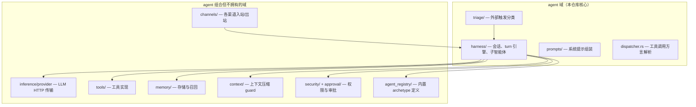
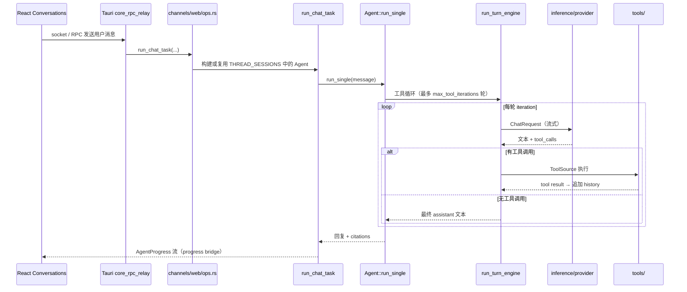
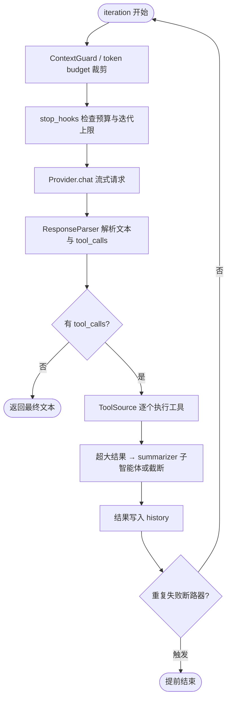
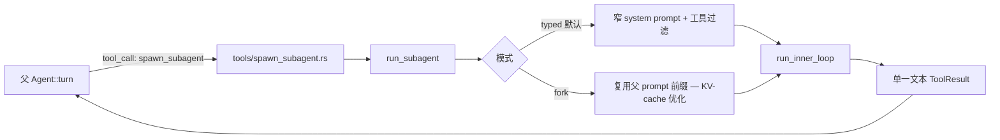
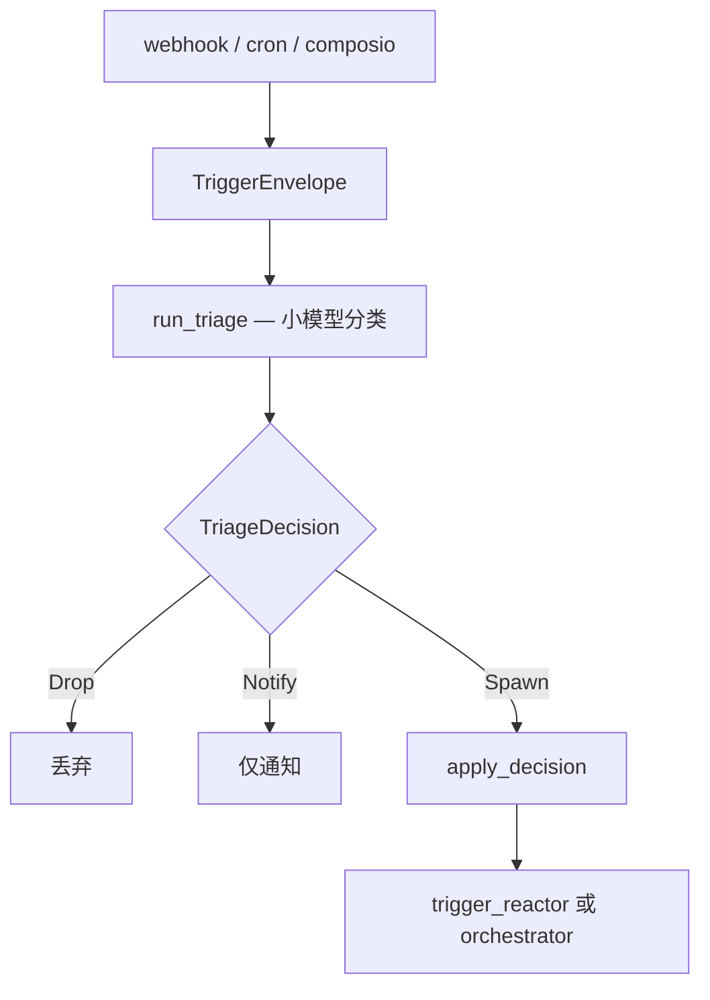

# OpenHuman 智能体代码架构

本文档从**源码视角**说明 OpenHuman 仓库中智能体（Agent）子系统的工作原理：模块边界、调用链、核心循环，以及与前端的进度同步。面向需要阅读或修改 `src/openhuman/agent/` 的开发者。

> **Draw.io 分层图（推荐）**
>
> 用 [draw.io](https://app.diagrams.net/) 或 VS Code Draw.io 插件打开：
> **[`docs/agent-architecture.drawio`](agent-architecture.drawio)**
>
> | 页签 | 内容 |
> |------|------|
> | 1-域分层架构 | L1～L5 五层：UI → 渠道 → agent 域 → 协作域 → 异步 hook |
> | 2-端到端调用链 | 用户消息 7 步 + turn / iteration 展开 |
> | 3-子智能体委托 | spawn_subagent · typed/fork · 回写父 history |
> | 4-触发器与模型路由 | triage · workload 路由 · 429 错误分类 |

> **相关文档**
>
> | 文档 | 侧重 |
> |------|------|
> | [`gitbooks/developing/architecture/agent-harness.md`](../gitbooks/developing/architecture/agent-harness.md) | 产品/贡献者向的概念说明（英文） |
> | [`gitbooks/developing/architecture/agent-harness.zh-CN.md`](../gitbooks/developing/architecture/agent-harness.zh-CN.md) | 同上（中文） |
> | [`docs/agent-subagent-tool-flow.md`](agent-subagent-tool-flow.md) | 父智能体 → 工具 → 子智能体调试手册（英文，部分路径已随重构更新，以本文为准） |
> | [`src/openhuman/agent/README.md`](../src/openhuman/agent/README.md) | 域模块 public API 索引 |

---

## 1. 设计原则：谁拥有什么

OpenHuman 把「智能体运行时」和「周边能力」刻意拆开：



**一句话**：`agent` 域负责「把一条用户/触发器输入跑完一整轮 LLM + 工具循环」；模型 HTTP、具体工具、记忆持久化、渠道协议都在别的域里。

---

## 2. 源码目录地图

```
src/openhuman/agent/
├── mod.rs                    # 域入口；导出 Agent、AgentBuilder、triage、dispatcher
├── harness/
│   ├── session/              # 有状态会话：Agent、AgentBuilder、turn 生命周期
│   │   ├── builder/          # 组装 provider、工具表、dispatcher、memory loader
│   │   ├── turn/             # Agent::turn / run_single 热路径
│   │   └── transcript.rs     # KV-cache 友好的转录持久化
│   ├── engine/               # ★ 统一 turn 引擎 run_turn_engine（唯一工具循环）
│   ├── subagent_runner/      # run_subagent：委托子智能体 mini-loop
│   ├── tool_loop.rs          # 轻量循环 + bus 路径 run_tool_call_loop
│   ├── definition.rs         # AgentDefinition、ToolScope、注册表类型
│   ├── fork_context.rs       # 父上下文 task-local（spawn_subagent 依赖）
│   ├── archivist/            # turn 后归档、情景记忆 ingest
│   └── compaction/           # 工具结果/JSON 压缩
├── triage/                   # webhook/cron/composio 触发分类流水线
├── prompts/                  # SystemPromptBuilder、SOUL/IDENTITY/USER 等
├── dispatcher.rs             # Native / XML / P-Format 工具调用解析
├── memory_loader.rs          # 每轮用户消息前的记忆召回
├── progress.rs               # AgentProgress 事件（推 UI）
├── bus.rs                    # event bus：agent.run_turn
├── tools/                    # agent 自有工具（spawn_subagent、delegate 等）
└── schemas.rs                # JSON-RPC：agent.chat、agent.list_definitions 等

src/openhuman/agent_registry/agents/   # 内置 archetype（orchestrator、context_scout…）
    └── */agent.toml + prompt.rs

src/openhuman/channels/providers/web/  # 桌面/Web 聊天入口
    └── run_task.rs → agent.run_single
```

---

## 3. 端到端：用户发一条聊天消息

桌面 **Conversations** 页面的典型路径如下。



### 3.1 关键入口文件

| 步骤 | 文件 | 职责 |
|------|------|------|
| 渠道调度 | `src/openhuman/channels/providers/web/ops.rs` | 包装 `turn_origin`、`approval` 上下文，`tokio::spawn` 跑 turn |
| 任务体 | `src/openhuman/channels/providers/web/run_task.rs` | 会话缓存、冷启动 resume、`agent.run_single` |
| Turn 热路径 | `src/openhuman/agent/harness/session/turn/core.rs` | `Agent::turn`：prompt、记忆、super context、调引擎 |
| 统一循环 | `src/openhuman/agent/harness/engine/core.rs` | `run_turn_engine` |
| 模型解析 | `src/openhuman/inference/provider/` | 按 `chat_provider` 等 workload 选模型并 HTTP 调用 |

### 3.2 会话缓存与 KV-cache

Web 渠道会为 `(client_id, thread_id)` 缓存 `Agent` 实例（`THREAD_SESSIONS`）。指纹变化（换模型、换 archetype）时重建。

**系统提示只在第一轮构建**，后续 turn 逐字复用，以保证推理后端 KV-cache 前缀稳定。动态内容（记忆召回、新学到的片段）作为**用户消息前缀**注入，而不是改 system prompt。

---

## 4. 统一 Turn 引擎（核心）

历史上 parent loop、bus loop、subagent loop 曾分散实现；现在**三处入口共用** `harness/engine/run_turn_engine`：

| 入口 | 调用方 | 典型场景 |
|------|--------|----------|
| `Agent::turn` | `session/turn/` + `turn_engine_adapter` | Web/桌面聊天、完整会话 |
| `run_tool_call_loop` | `harness/tool_loop.rs`、`bus.rs` | 渠道 native bus、轻量 turn |
| `run_subagent` | `harness/subagent_runner/` | `spawn_subagent` 委托 |

### 4.1 单轮 iteration 流程



引擎通过 **seam（接缝）** 适配不同调用方，避免复制循环逻辑：

| Seam | 作用 |
|------|------|
| `ToolSource` | 向模型暴露哪些工具 + 如何执行一次调用 |
| `ProgressReporter` | `Turn*` / `Subagent*` 进度事件 + token 流 |
| `TurnObserver` | 上下文压缩、转录持久化、history 形态 |
| `CheckpointStrategy` | 迭代上限到达时：报错 vs 生成摘要 checkpoint |
| `ResponseParser` | 绑定 `ToolDispatcher` 方言（Native/XML/P-Format） |

默认 **`max_tool_iterations = 10`**（`config.agent.max_tool_iterations`）。

---

## 5. Agent 会话构建

`AgentBuilder::build`（`harness/session/builder/`）在 turn 开始前组装：

- **Provider**：由 `config.chat_provider` 等 workload 字段 + `inference/provider/factory.rs` 解析（如 `openai:gpt-4o`）
- **完整工具注册表** vs **模型可见工具集**（可见集是注册表的子集）
- **MemoryLoader** + **SystemPromptBuilder**
- **ToolDispatcher**（按 provider 选 Native/XML/P-Format）
- **ContextManager**（microcompact / autocompact）

若 archetype 的 `agent.toml` 声明了 `subagents = [...]`，builder 还会合成 `delegate_*` 工具（见 `tools/orchestrator_tools.rs`），把委托包装成普通 tool call。

---

## 6. 子智能体（Sub-agent）

子智能体**不是**第二个完整 `Agent` 会话，而是「作为工具实现的一次 mini LLM 循环」。



### 6.1 要点

- **父模型看不到子智能体内部 transcript**，只收到 `spawn_subagent` 返回的紧凑文本。
- **`ParentExecutionContext`**（`fork_context.rs`）通过 task-local 注入；在父 turn 外调用 `spawn_subagent` 会 `NoParentContext` 失败。
- **工具过滤**：子 archetype 的 `tools` / `disallowed_tools` / `skill_filter` 在父工具列表上按索引过滤，不是克隆整个注册表。
- **内置定义**在 `src/openhuman/agent_registry/agents/*/agent.toml`，由 `agent_registry/agents/loader.rs` 加载到全局 `AgentDefinitionRegistry`。

### 6.2 常见内置 archetype（节选）

| ID | 用途 |
|----|------|
| `orchestrator` | 用户面对话主智能体 |
| `context_scout` | 新线程 super context 预研（首 turn 可自动 spawn） |
| `settings_agent` | 设置相关子任务 |
| `integrations_agent` | Composio 集成（特殊 text-mode 工具调用） |
| `summarizer` | 超大 tool result 压缩 |
| `trigger_reactor` / `trigger_triage` | 外部触发流水线 |

---

## 7. 外部触发：Triage 流水线

用户主动聊天**不经过** triage；**webhook、cron、Composio 事件**等外部触发才走。



代码：`src/openhuman/agent/triage/`（`evaluator.rs`、`escalation.rs`、`routing.rs`）。

---

## 8. 推理与模型路由

聊天 turn 使用的模型由 **workload 字段**决定（`config.toml`）：

```toml
chat_provider = "openai:gpt-4o"       # 对话 / Quick 模式
reasoning_provider = "..."            # Reasoning 模式、主 agent
agentic_provider = "..."              # 子 agent、工具循环
# 还有 coding / vision / memory / heartbeat / learning / subconscious
```

解析链：

1. `channels/runtime/startup.rs` — 启动时解析 chat workload → `Provider`
2. `inference/provider/factory.rs` — `create_chat_provider_from_string`：cloud / openhuman / BYOK / ollama
3. `inference/provider/reliable.rs` — 重试、fallback、`model_fallbacks`

**BYOK**：需在 `cloud_providers` 中配置 endpoint，并在 Settings 保存 API Key；仅设 `inference_url` 而无匹配 provider 条目会 **fail-closed**（`BYOK_INCOMPLETE`）。

错误分类（含 429 限流 vs 配额用尽）在 `channels/providers/web_errors.rs` → 前端展示文案。

---

## 9. 工具层

| 层级 | 位置 | 说明 |
|------|------|------|
| 工具实现 | `src/openhuman/tools/` | 各域 `tools.rs` 汇总到 `tools/mod.rs` |
| Agent 自有工具 | `src/openhuman/agent/tools/` | `spawn_subagent`、`delegate_*`、`ask_clarification` 等 |
| 执行边界 | `harness/session/agent_tool_exec.rs` | 审批门、沙箱、路径策略 |
| 策略 | `agent/tool_policy.rs` | 按 autonomy tier 过滤 |

工具调用方言（`dispatcher.rs`）：

- **Native** — OpenAI/Anthropic 结构化 `tool_calls`
- **XML** — `<tool_call>{...}</tool_call>` 文本解析
- **P-Format** — 紧凑文本格式（小模型）

---

## 10. 进度事件与前端 UI

Rust 侧 `progress::AgentProgress` 经 web channel **progress bridge** 推到 socket；React **`Conversations`** 页面渲染：

- 流式 token
- 工具时间线（`ToolTimelineBlock`）
- 「智能体处理来源」面板（`AgentProcessSourcePanel`）— 完整步骤 + 访问过的 URL

相关前端：

- `app/src/pages/Conversations.tsx`
- `app/src/pages/conversations/components/ToolTimelineBlock.tsx`
- `app/src/store/chatRuntimeSlice.ts` — `ToolTimelineEntry`

---

## 11. 安全、审批与 turn 来源

| 机制 | 代码 | 行为 |
|------|------|------|
| Turn 来源 | `agent/turn_origin.rs` | WebChat / Cron / CLI 等标签，供审批门决策 |
| 审批门 | `approval/` + `APPROVAL_CHAT_CONTEXT` | 交互式 turn 可暂停等待用户批准工具 |
| Autonomy | `config.autonomy` + `security/policy.rs` | 命令分类 Read/Write/Network/Install/Destructive |
| 沙箱 | `config.sandbox` + `harness/sandbox_context.rs` | 可选 Landlock/Docker 等 |

Web 聊天在 `web/ops.rs` 中同时注入 `AgentTurnOrigin::WebChat` 与 `ApprovalChatContext`。

---

## 12. Turn 之后（异步 Hook）

用户看到回复后，后台仍可能运行：

- **Archivist** — 情景记忆、tree ingest（`harness/archivist/`）
- **Learning** — reflection、tool tracking（`learning/` 域读 transcript）
- **Cost** — `agent/cost.rs` 记 turn 成本

这些不在 `run_turn_engine` 的关键路径上，避免拖慢首字节。

---

## 13. 调试清单

### 13.1 先确认你在哪条执行链上

- 完整 **`Agent::turn` / `run_single`**（Web 聊天）？
- Bus **`agent.run_turn`**（`bus.rs` → `run_tool_call_loop`）？
- **`spawn_subagent`** 子循环？

混用会导致日志看起来「矛盾」。

### 13.2 推荐 grep 前缀

```
[web-channel]
[agent]
[agent_loop]
[tool-loop]
[spawn_subagent]
[subagent_runner]
[providers][chat-factory]
[channels][startup]
[transcript]
```

日志文件（桌面默认）：`~/.openhuman/logs/openhuman.*.log`

### 13.3 推荐测试入口

| 测试 | 文件 |
|------|------|
| Harness E2E | `tests/agent_harness_e2e.rs` |
| spawn_subagent 全路径 | `src/openhuman/agent/harness/session/tests.rs` |
| Turn 引擎 | `src/openhuman/agent/harness/engine/core_tests.rs` |
| Subagent runner | `src/openhuman/agent/harness/subagent_runner/ops_tests.rs` |
| Web 渠道 | `tests/channels_web_*_e2e.rs` |

---

## 14. 心智模型（总结）

```text
渠道消息 / 外部触发
        │
        ▼
   triage?（仅外部触发）
        │
        ▼
  Agent 会话（有状态 history + 一次 system prompt）
        │
        ▼
  run_turn_engine（无状态循环，唯一实现）
        │
        ├── Provider（inference 域）
        └── Tools（tools 域；含 spawn_subagent → run_subagent）
        │
        ▼
  最终 assistant 文本 → 渠道/UI
        │
        └── 异步 hook：archivist · learning · cost
```

**记住三点**：

1. **一个引擎、三个入口** — 循环逻辑只在 `engine/core.rs`。
2. **子智能体是工具** — 父 history 只吸收子 agent 的最终字符串。
3. **Prompt 字节稳定** — system prompt 不每轮重建；动态上下文走 user 消息侧车。

---

## 15. 文档维护

若重构移动模块路径，请同步更新：

- 本文（`docs/agent-architecture.zh-CN.md`）
- [`src/openhuman/agent/README.md`](../src/openhuman/agent/README.md)
- GitBook [`agent-harness.md`](../gitbooks/developing/architecture/agent-harness.md) 中的概念描述（无需重复文件级路径）

生成式文档块（provider chain 等）遵循 `pnpm docs:generate` / Docs Drift CI 规则，见根目录 `AGENTS.md`。
